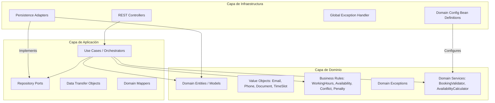

# MediSalud Backend - Sistema de Agendamiento de Citas Médicas

MediSalud es un sistema de backend robusto diseñado para la gestión y agendamiento de citas médicas. El proyecto está construido siguiendo los más altos estándares de desarrollo, aplicando Arquitectura Hexagonal y principios de diseño SOLID para garantizar mantenibilidad, escalabilidad y facilidad de pruebas.

## 🏗️ Arquitectura

El proyecto implementa una **Arquitectura Hexagonal (Puertos y Adaptadores)**. Esta arquitectura desacopla el núcleo lógico del negocio de las tecnologías externas (bases de datos, frameworks web, etc.), permitiendo que el sistema evolucione sin afectar las reglas fundamentales.

### Diagrama de Arquitectura (C4 - Simplificado)



### Justificación de la Arquitectura
- **Independencia del Framework:** El dominio es código Java puro, sin anotaciones de Spring (excepto en la capa de infraestructura que lo configura), lo que lo hace portable y fácil de probar.
- **Testabilidad:** Permite realizar pruebas unitarias del dominio y de los casos de uso con mocks simples, sin necesidad de levantar el contexto de Spring.
- **Mantenibilidad:** Las reglas de negocio están centralizadas y aisladas, lo que facilita cambios en la lógica sin efectos secundarios inesperados en los adaptadores.
- **Fuerte Tipado:** Uso extensivo de Value Objects para evitar la "Obsesión por Primitivos" y garantizar que los datos sean válidos desde su creación.

## 🛠️ Decisiones de Diseño y Clean Code

Se aplicaron estrictamente los siguientes principios de nivel Senior:

- **SOLID:**
    - **Single Responsibility:** Cada caso de uso (e.g., `RegisterDoctorUseCase`) tiene una sola responsabilidad.
    - **Open/Closed:** Las reglas de negocio se aplican a través de un motor de validación que permite extender las reglas sin modificar los casos de uso.
    - **Dependency Inversion:** La capa de aplicación depende de abstracciones, no de detalles.
- **DRY (Don't Repeat Yourself):** Uso de MapStruct para mapeos automáticos y centralizados entre DTOs, Modelos y Entidades.
- **KISS (Keep It Simple, Stupid):** A pesar de la arquitectura robusta, el código es directo y evita abstracciones innecesarias.
- **Encapsulamiento de Lógica en el Dominio:** Los modelos de dominio no son simples POJOs; contienen lógica de estado y validaciones (e.g., `Appointment.cancel()`).
- **Nombres Expresivos:** Código auto-documentado mediante una nomenclatura clara y consistente.

## 🚀 Cómo ejecutar el proyecto

### Prerrequisitos
- **Java 21**
- **Gradle 8.10+** (se incluye el wrapper)

### Ejecución local
```powershell
./gradlew bootRun
```
La aplicación iniciará en `http://localhost:8080`.

### Acceso a Base de Datos (H2)
La consola de H2 está habilitada para desarrollo en:
- **URL:** `http://localhost:8080/h2-console`
- **JDBC URL:** `jdbc:h2:mem:medisalud`
- **User:** `sa`
- **Password:** (en blanco)

## 🐳 Docker

El proyecto incluye un `Dockerfile` multietapa y `docker-compose.yml`.

### Levantar con Docker Compose
```powershell
docker-compose up --build
```
Esto compila el código, corre las pruebas y levanta el servicio en el puerto `8080`.

## 🧪 Pruebas y Cobertura

### Ejecutar pruebas
```powershell
./gradlew clean test
```

### Generar reporte de cobertura (JaCoCo)
```powershell
./gradlew jacocoTestReport
```
El reporte HTML se encontrará en: `build/reports/jacoco/test/html/index.html`

**Estado de Cobertura actual:** `87%` (Superando el objetivo del 85%).

## 📖 Documentación de la API (Swagger)

La documentación interactiva de la API (OpenAPI 3.0) está disponible en:
- **Swagger UI:** `http://localhost:8080/swagger-ui/index.html`

## 🔗 Endpoints Principales

### Médicos (Doctors)
- `GET /api/v1/doctors` - Listar todos los médicos.
- `POST /api/v1/doctors` - Registrar nuevo médico.
- `GET /api/v1/doctors/{id}` - Obtener médico por ID.
- `DELETE /api/v1/doctors/{id}` - Eliminar médico.

### Pacientes (Patients)
- `GET /api/v1/patients` - Listar todos los pacientes.
- `POST /api/v1/patients` - Registrar nuevo paciente.
- `GET /api/v1/patients/{id}` - Obtener paciente por ID.

### Citas (Appointments)
- `POST /api/v1/appointments` - Reservar una cita.
- `POST /api/v1/appointments/{id}/cancel` - Cancelar una cita (aplica penalización si es < 2h).
- `POST /api/v1/appointments/{id}/reschedule` - Reprogramar una cita (Cancela + Crea nueva).
- `GET /api/v1/appointments/availability` - Consultar disponibilidad de un médico.

## 📝 Ejemplos de Request/Response

### Reservar Cita (`POST /api/v1/appointments`)

**Request:**
```json
{
  "doctorId": "550e8400-e29b-41d4-a716-446655440000",
  "patientId": "678e8400-e29b-41d4-a716-446655440000",
  "start": "2026-07-15T10:00:00"
}
```

**Response (201 Created):**
```json
{
  "id": "a1b2c3d4-e5f6-g7h8-i9j0-k1l2m3n4o5p6",
  "doctorId": "550e8400-e29b-41d4-a716-446655440000",
  "patientId": "678e8400-e29b-41d4-a716-446655440000",
  "start": "2026-07-15T10:00:00",
  "end": "2026-07-15T10:30:00",
  "status": "BOOKED"
}
```

### Respuesta de Error (Ejemplo Conflicto de Negocio)

**Response (409 Conflict):**
```json
{
  "timestamp": "2026-07-02T14:15:00Z",
  "status": 409,
  "error": "Conflict",
  "code": "DOCTOR_UNAVAILABLE",
  "message": "El médico ya tiene una cita programada en ese horario.",
  "path": "/api/v1/appointments"
}
```

## ✅ Reglas de Negocio Implementadas (RN)
- **RN01:** Horarios de atención estrictos (Lun-Vie 8-18, Sab 8-13, Dom no atiende). Citas de 30 min.
- **RN02:** No doble cita para el mismo médico.
- **RN03:** No fecha de nacimiento futura. Edad 0 por defecto.
- **RN04:** No doble cita para el mismo paciente con el mismo médico.
- **RN05:** Penalización por cancelación tardía (< 2h). Bloqueo tras 3 penalizaciones en 30 días.
- **RN06:** Reprogramación atómica (Cancelar + Penalizar + Crear).

---
Desarrollado con estándares de **Arquitectura Senior** para MediSalud.
